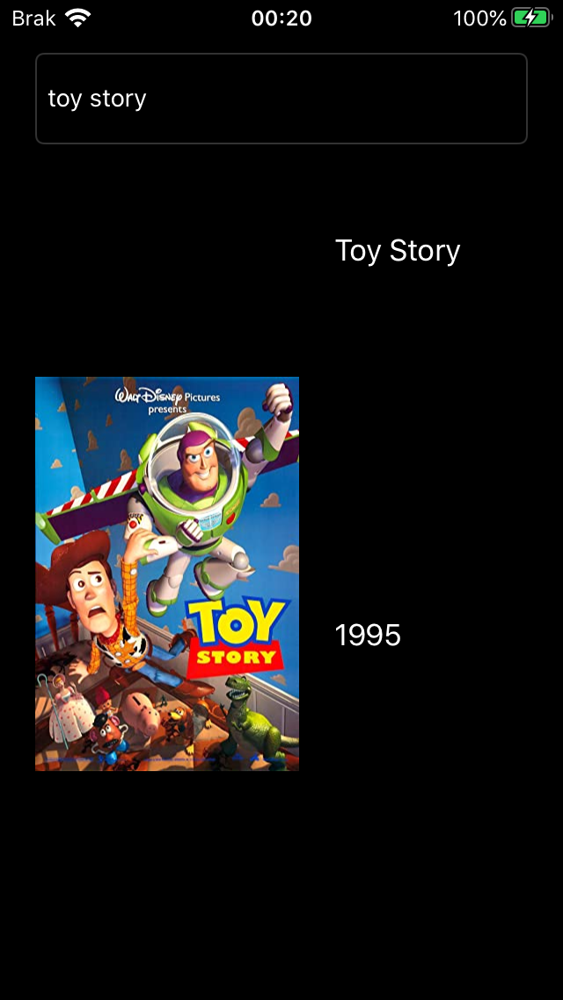
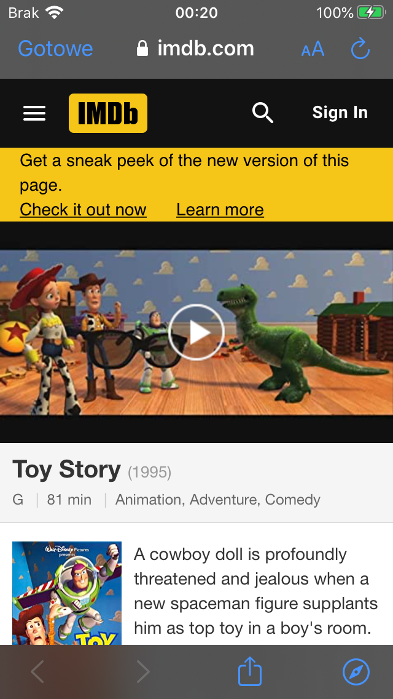

# MovieFinder

App written in Swift using UIKit that allows user to find movies on imdb by giving its name.

Functionalities:
- displaying movies, theirs titles, posters and production years in table view after giving text in text field
- redirecting to imdb page after touching on one of the displayed movies
- using imdb API to acquire movies data

